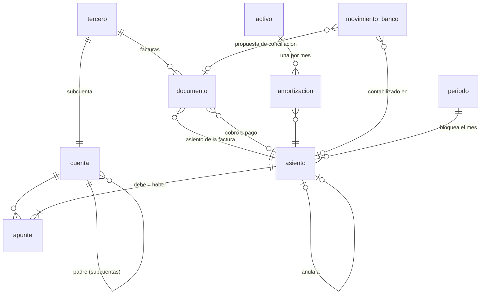

# 05 · Arquitectura y plan de construcción

## 1. Decisión previa: ¿contabilidad completa o capa de control?

| Opción | Qué es | Pros | Contras |
|---|---|---|---|
| **A. Capa de control** (recomendada para empezar) | Se conecta a la contabilidad que ya lleva la gestoría (A3, Sage, Holded...) importando el diario, y a los bancos. Aporta controles, autoclasificación, KPIs, cierre y data room de due diligence | Arranque rápido; no compite con el software de la gestoría; no es software de facturación, así que no le afecta Verifactu al principio | Depende de importar bien diarios de terceros |
| B. Contabilidad completa | Libro mayor propio, emisión de facturas, fiscal | Control total del dato | Mucho más alcance; si emite facturas debe cumplir el reglamento de sistemas de facturación (Verifactu) y la factura electrónica |

El núcleo (libro mayor + controles) es el mismo en las dos, así que **empezar por A no cierra el camino a B**.

**La versión 1 sigue la opción A, pero funciona sola:** lleva su propio libro mayor (se puede importar el diario de la gestoría o contabilizar directamente) y *registra* las facturas que se emiten con otro programa, sin emitirlas.

## 2. Módulos

| Módulo | Contenido |
|---|---|
| **M1 Libro mayor** | Plan de cuentas, asientos, apuntes, dimensiones, periodos, auditoría. Partida doble garantizada por la base de datos |
| **M2 Terceros y documentos** | Clientes, proveedores, socios, empleados (NIF, vinculado); facturas emitidas y recibidas; contratos |
| **M3 Bancos** | Importación Norma 43 / PSD2, conciliación, autoclasificador ([04](04-autoclasificador-ia.md)) |
| **M4 Fiscal** | Libros registro de IVA, borradores de 303/111/115/349/347/390/190/180, calendario con alertas |
| **M5 Nóminas** | Importar el asiento de nóminas de la gestoría y cuadrar 465/476/4751 |
| **M6 Activos y financiación** | Inmovilizado con amortización automática, préstamos con cuadro y reclasificación a corto, subvenciones, capital y cap table |
| **M7 Cierre y controles** | Checklist de cierre, controles de los tres niveles, alertas, cola de preguntas, bloqueo del mes |
| **M8 Reporting** | Sumas y saldos, balance y PyG oficiales, PyG de gestión, KPIs, data room de due diligence |
| **M9 Planificación** | Presupuesto, previsión continua, tesorería a 13 semanas, escenarios, runway |

## 3. Modelo de datos

Definido en [`db/schema.sql`](../db/schema.sql):



Además: `regla` (clasificación bancaria), `saldo_externo` (controles de nivel 3), `evento` (rastro de auditoría) y
`config`. Los apuntes no se pueden modificar ni borrar (triggers): lo contabilizado se anula con el asiento inverso.

En producción, **PostgreSQL**. La regla de oro (un asiento descuadrado no puede existir) se convierte en un trigger
diferido que se comprueba al confirmar la transacción, cuando ya están todos los apuntes:

```sql
CREATE FUNCTION comprobar_cuadre() RETURNS trigger LANGUAGE plpgsql AS $$
DECLARE a bigint := COALESCE(NEW.asiento_id, OLD.asiento_id);
BEGIN
  IF (SELECT COALESCE(SUM(debe) - SUM(haber), 0) FROM apunte WHERE asiento_id = a) <> 0 THEN
    RAISE EXCEPTION 'Asiento % descuadrado', a;
  END IF;
  RETURN NULL;
END $$;

CREATE CONSTRAINT TRIGGER asiento_cuadrado
AFTER INSERT OR UPDATE OR DELETE ON apunte
DEFERRABLE INITIALLY DEFERRED
FOR EACH ROW EXECUTE FUNCTION comprobar_cuadre();
```

Si el producto da servicio a varias empresas, cada tabla lleva `empresa_id` y seguridad a nivel de fila.

## 4. Stack recomendado

- **Base de datos:** SQLite en la versión 1 (un fichero por empresa, sin instalar nada). PostgreSQL para multiusuario (restricciones, triggers diferidos, seguridad por fila).
- **Backend:** Python. La versión 1 usa solo la biblioteca estándar (servidor web incluido); para multiusuario, FastAPI.
- **Frontend:** HTML generado en el servidor, sin JavaScript. Si hace falta una interfaz más rica, un frontend web aparte.
- **Integraciones:** agregador bancario PSD2 con licencia de acceso a cuentas, ficheros Norma 43 como alternativa; AEAT con certificado; importación de diarios de los programas de las gestorías.
- **Alojamiento en la UE** (RGPD) y copias de seguridad cifradas.

## 5. Estado y siguientes pasos

### Hecho (versión 1)

| Módulo | Qué hay |
|---|---|
| M1 Libro mayor | Plan PGC PYMES con subcuentas, asientos validados (cuadre, cuentas, mes abierto), libro inmutable con anulación por asiento inverso, importación del diario de la gestoría (todo o nada), dimensiones analíticas y marca de no recurrente |
| M2 Terceros y documentos | Terceros con NIF validado, subcuenta propia y marca de vinculado/extranjero; registro de facturas emitidas y recibidas con su asiento (IVA, retención, inversión del sujeto pasivo), cobro y pago, antigüedad de saldos |
| M3 Bancos | Norma 43 (con comprobación de totales) y CSV, sin duplicados al reimportar; conciliación con facturas, reglas, IA opcional, cola de revisión y reglas aprendidas |
| M4 Fiscal | Borradores de 303 (cuadrado contra el libro), 111 y 347; regularización trimestral del IVA; calendario de vencimientos |
| M6 Activos | Registro de inmovilizado (alta automática desde la factura) y amortización mensual automática |
| M7 Cierre y controles | Controles de los tres niveles, saldos externos, cierre que amortiza y bloquea el mes si nada falla, reapertura con motivo, regularización del ejercicio, rastro de auditoría |
| M8 Reporting | Panel con KPIs (tesorería, burn, runway, EBITDA, DFN, periodos de cobro y pago, liquidez), sumas y saldos, mayor, PyG mensual de gestión, balance, data room de due diligence en un zip |

### Pendiente (por orden de valor)

| Siguiente | Qué falta | Terminado cuando... |
|---|---|---|
| 1 | Conjunto de evaluación de la IA con movimientos reales anonimizados | Se mide % automático y % de acierto antes de activar la IA en serio |
| 2 | Préstamos con cuadro de amortización (principal, intereses, reclasificación a corto) y CIRBE | Control C23/C24 automático |
| 3 | Presupuesto y previsión de tesorería a 13 semanas (M9) | Real vs presupuesto mensual con desviaciones |
| 4 | Cobros y pagos parciales, facturas con varios tipos de IVA, rectificativas | Sin limitaciones conocidas en facturas |
| 5 | Importación del asiento de nóminas y resumen de nóminas (M5) | Control C20 automático |
| 6 | Cap table, subvenciones y periodificaciones (480/485) | Checklist de due diligence completo |
| 7 | PostgreSQL, usuarios y permisos, varias empresas | Se puede usar en la nube con varias personas |
| 8 | Conexión bancaria PSD2 y presentación en la AEAT | Sin ficheros manuales |

## 6. Decisiones abiertas

1. ¿Para una startup concreta o como producto para muchas? Cambia la multiempresa, los usuarios y el soporte.
2. Agregador bancario PSD2: elegir proveedor (coste por cuenta conectada, bancos cubiertos).
3. Qué formatos de diario de gestoría importar además del CSV genérico.
4. Licencia del código si se quiere que otros lo usen y contribuyan.
