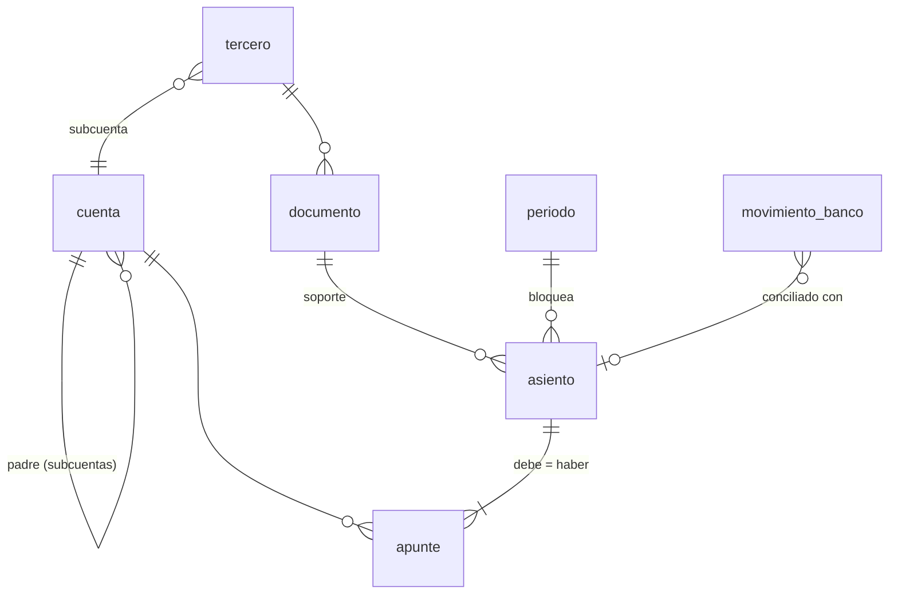

# 05 · Arquitectura y plan de construcción

## 1. Decisión previa: ¿contabilidad completa o capa de control?

| Opción | Qué es | Pros | Contras |
|---|---|---|---|
| **A. Capa de control** (recomendada para empezar) | Se conecta a la contabilidad que ya lleva la gestoría (A3, Sage, Holded...) importando el diario, y a los bancos. Aporta controles, autoclasificación, KPIs, cierre y data room de due diligence | Arranque rápido; no compite con el software de la gestoría; no es software de facturación, así que no le afecta Verifactu al principio | Depende de importar bien diarios de terceros |
| B. Contabilidad completa | Libro mayor propio, emisión de facturas, fiscal | Control total del dato | Mucho más alcance; si emite facturas debe cumplir el reglamento de sistemas de facturación (Verifactu) y la factura electrónica |

El núcleo (libro mayor + controles) es el mismo en las dos, así que **empezar por A no cierra el camino a B**.

## 2. Módulos

| Módulo | Contenido |
|---|---|
| **M1 Libro mayor** | Plan de cuentas, asientos, apuntes, dimensiones, periodos, auditoría. Partida doble garantizada por la base de datos |
| **M2 Terceros y documentos** | Clientes, proveedores, socios, empleados (NIF, vinculado); facturas emitidas y recibidas; contratos |
| **M3 Bancos** | Importación Norma 43 / PSD2, conciliación, autoclasificador ([04](04-autoclasificador-ia.md)) |
| **M4 Fiscal** | Libros registro de IVA, borradores de 303/111/115/349/347/390/190/180, calendario con alertas |
| **M5 Nóminas** | Importar el asiento de nóminas de la gestoría y cuadrar 465/476/4751 |
| **M6 Activos y financiación** | Inmovilizado con amortización automática, préstamos con cuadro y reclasificación a corto, subvenciones, capital y cap table |
| **M7 Cierre y controles** | Checklist de cierre, controles de los tres niveles, alertas, cola de preguntas, bloqueo del mes |
| **M8 Reporting** | Sumas y saldos, balance y PyG oficiales, PyG de gestión, KPIs, data room de due diligence |
| **M9 Planificación** | Presupuesto, previsión continua, tesorería a 13 semanas, escenarios, runway |

## 3. Modelo de datos

Definido en [`db/schema.sql`](../db/schema.sql):



En producción, **PostgreSQL**. La regla de oro (un asiento descuadrado no puede existir) se convierte en un trigger
diferido que se comprueba al confirmar la transacción, cuando ya están todos los apuntes:

```sql
CREATE FUNCTION comprobar_cuadre() RETURNS trigger LANGUAGE plpgsql AS $$
DECLARE a bigint := COALESCE(NEW.asiento_id, OLD.asiento_id);
BEGIN
  IF (SELECT COALESCE(SUM(debe) - SUM(haber), 0) FROM apunte WHERE asiento_id = a) <> 0 THEN
    RAISE EXCEPTION 'Asiento % descuadrado', a;
  END IF;
  RETURN NULL;
END $$;

CREATE CONSTRAINT TRIGGER asiento_cuadrado
AFTER INSERT OR UPDATE OR DELETE ON apunte
DEFERRABLE INITIALLY DEFERRED
FOR EACH ROW EXECUTE FUNCTION comprobar_cuadre();
```

Si el producto da servicio a varias empresas, cada tabla lleva `empresa_id` y seguridad a nivel de fila.

## 4. Stack recomendado

- **Base de datos:** PostgreSQL (restricciones, triggers diferidos, seguridad por fila). SQLite solo para el prototipo.
- **Backend:** Python (FastAPI): el ecosistema de datos y el SDK de Claude están ahí, y el prototipo ya es Python.
- **Frontend:** web (p. ej. Next.js) cuando haga falta interfaz; al principio basta con informes y la cola de revisión.
- **Integraciones:** agregador bancario PSD2 con licencia de acceso a cuentas, ficheros Norma 43 como alternativa; AEAT con certificado; importación de diarios de los programas de las gestorías.
- **Alojamiento en la UE** (RGPD) y copias de seguridad cifradas.

## 5. Plan por fases

Cada fase tiene un criterio de terminado que se puede comprobar.

| Fase | Qué se construye | Terminado cuando... |
|---|---|---|
| **0 · Hecho** | Análisis, estructura, plan de cuentas, catálogos, prototipo de motor de cuadre y clasificador | `python test_cuentas_claras.py` da OK |
| **1 · Núcleo** | Esquema en Postgres, API de asientos con partida doble, importador de diarios (CSV y formatos de gestoría), BSS, balance y PyG, controles de nivel 1 y 2, bloqueo de periodos | Se reproduce al céntimo el BSS de una empresa real anonimizada |
| **2 · Bancos** | Norma 43 / PSD2, conciliación con facturas abiertas, reglas, IA con cola de revisión, conjunto de evaluación | ≥ 90 % resuelto y ≥ 98 % de acierto en el conjunto de evaluación |
| **3 · Documentos y fiscal** | Facturas recibidas con extracción; emitidas con numeración y formato estructurado (si se elige la opción B); libros de IVA; borradores 303/111/115/347; controles fiscales de nivel 3 | El 303 y el 111 del trimestre cuadran con lo presentado |
| **4 · Cierre y reporting** | Checklist de cierre, alertas de anomalías, cola de preguntas, PyG de gestión, KPIs, tesorería, presupuesto vs real, informe mensual | Cierre mensual en ≤ 5 días hábiles |
| **5 · Due diligence** | Inmovilizado, préstamos, subvenciones, cap table, partes vinculadas, EBITDA ajustado, exportación del data room según [`checklist_dd.csv`](../data/checklist_dd.csv) | Las peticiones de Fase I del checklist se generan con un clic |
| **6 · Planificación** | Presupuesto, previsión continua, escenarios, runway | Previsión de tesorería a 13 semanas con alertas |

## 6. Decisiones abiertas

1. Opción A (capa de control) o B (contabilidad completa) — sección 1.
2. ¿Para una startup concreta o como producto para muchas? Cambia la multiempresa, la facturación y el soporte.
3. Agregador bancario PSD2: elegir proveedor (coste por cuenta conectada, bancos cubiertos).
4. Qué formatos de diario de gestoría importar primero (depende de con qué gestoría se trabaje).
